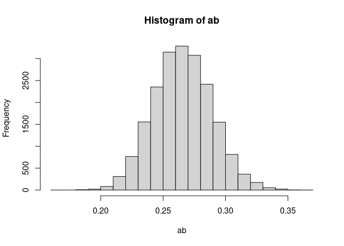

semmcci
================
Ivan Jacob Agaloos Pesigan
2020-12-04

<!-- README.md is generated from README.Rmd. Please edit that file -->

## Monte Carlo Confidence Intervals

`semmcci` calculates Monte Carlo confidence intervals for parameters
defined using the `:=` operator in the structural equation modeling
package `lavaan`. The output of `lavaan` is passed as the first argument
to the `mc` function in `semmcci` in order to generate Monte Carlo
confidence intervals for defined parameter/s.

## Installation

You can install the released version of `semmcci` from
[GitHub](https://github.com/jeksterslabds/semmcci) with:

``` r
library(devtools)
install_github("jeksterslabds/semmcci")
```

## Example

### Data

``` r
n <- 1000
x <- rnorm(n = n)
m <- 0.50 * x + rnorm(n = n)
y <- 0.25 * x + 0.50 * m + rnorm(n = n)
data <- data.frame(
  x,
  m,
  y
)
```

### Model Specification in lavaan

The first step is to define a `lavaan` model using the `lavaan` model
syntax. In this example, we look at a simple mediation model where `x`
is the predictor, `m` is the mediator, and `y` is the dependent
variable. The indirect effect is defined by the product of the slopes of
paths `x` to `m` labelled as `a` and `m` to `y` labelled as `b`. We are
interested in the confidence intervals of `ab` defined as the product of
`a` and `b` using the `:=` operator.

``` r
model <- "
  y ~ x + b * m
  m ~ a * x
  ab := a * b
"
```

### Model Fitting in lavaan

We can now fit the model and save the `lavaan` object to `fit`.

``` r
library(lavaan)
#> This is lavaan 0.6-7
#> lavaan is BETA software! Please report any bugs.
fit <- sem(
  model = model,
  data = data
)
```

### Monte Carlo Method Confidence Intervals

We can now construct confidence intervals around `ab` by passing `fit`
to the `mc` function.

``` r
library(semmcci)
mc(fit)
```



    #>       est     se ci_0.05 ci_0.5 ci_2.5 ci_97.5 ci_99.5 ci_99.95
    #> ab 0.1916 0.0194  0.1332 0.1443 0.1553  0.2307  0.2436   0.2563

## More Information

See [GitHub Pages](https://jeksterslabds.github.io/semmcci/index.html)
for package documentation.
