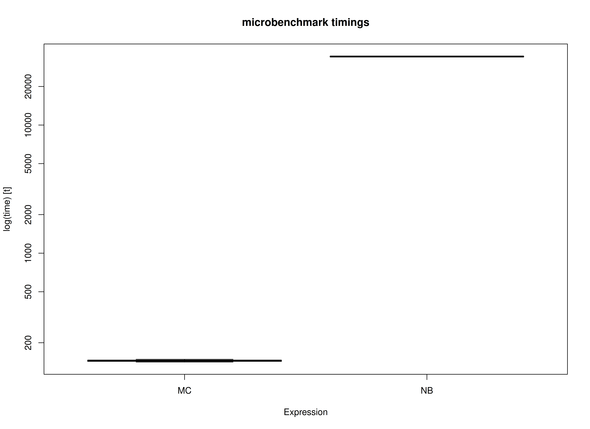
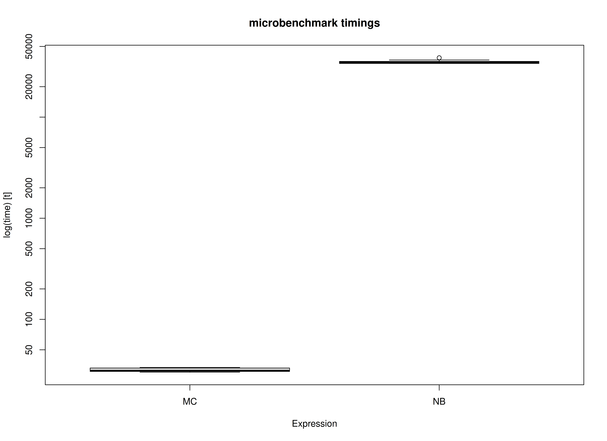

# Benchmark: Comparing the Monte Carlo Method with Nonparametric Bootstrapping (FIML)

We compare the Monte Carlo (MC) method with nonparametric bootstrapping
(NB) using the simple mediation model with missing data using
full-information maximum likelihood. One advantage of MC over NB is
speed. This is because the model is only fitted once in MC whereas it is
fitted many times in NB.

``` r

library(semmcci)
library(lavaan)
library(microbenchmark)
```

## Data

``` r

n <- 1000
a <- 0.50
b <- 0.50
cp <- 0.25
s2_em <- 1 - a^2
s2_ey <- 1 - cp^2 - a^2 * b^2 - b^2 * s2_em - 2 * cp * a * b
em <- rnorm(n = n, mean = 0, sd = sqrt(s2_em))
ey <- rnorm(n = n, mean = 0, sd = sqrt(s2_ey))
X <- rnorm(n = n)
M <- a * X + em
Y <- cp * X + b * M + ey
df <- data.frame(X, M, Y)

# Create data set with missing values.

miss <- sample(1:dim(df)[1], 300)
df[miss[1:100], "X"] <- NA
df[miss[101:200], "M"] <- NA
df[miss[201:300], "Y"] <- NA
```

## Model Specification

The indirect effect is defined by the product of the slopes of paths `X`
to `M` labeled as `a` and `M` to `Y` labeled as `b`. In this example, we
are interested in the confidence intervals of `indirect` defined as the
product of `a` and `b` using the `:=` operator in the `lavaan` model
syntax.

``` r

model <- "
  Y ~ cp * X + b * M
  M ~ a * X
  X ~~ X
  indirect := a * b
  direct := cp
  total := cp + (a * b)
"
```

## Model Fitting

We can now fit the model using the
[`sem()`](https://rdrr.io/pkg/lavaan/man/sem.html) function from
`lavaan`. We are using `missing = "fiml"` to handle missing data in
`lavaan`.

``` r

fit <- sem(data = df, model = model)
```

## Monte Carlo Confidence Intervals

The `fit` `lavaan` object can then be passed to the
[`MC()`](https://github.com/jeksterslab/semmcci/reference/MC.md)
function from `semmcci` to generate Monte Carlo confidence intervals.

``` r

MC(fit, R = 100L, alpha = 0.05)
#> Monte Carlo Confidence Intervals
#>             est     se   R   2.5%  97.5%
#> cp       0.2419 0.0332 100 0.1792 0.3070
#> b        0.5166 0.0308 100 0.4580 0.5785
#> a        0.4989 0.0319 100 0.4448 0.5615
#> X~~X     1.0951 0.0621 100 0.9875 1.2045
#> Y~~Y     0.5796 0.0307 100 0.5179 0.6336
#> M~~M     0.8045 0.0464 100 0.7325 0.9106
#> indirect 0.2577 0.0210 100 0.2234 0.3031
#> direct   0.2419 0.0332 100 0.1792 0.3070
#> total    0.4996 0.0322 100 0.4550 0.5681
```

## Nonparametric Bootstrap Confidence Intervals

Nonparametric bootstrap confidence intervals can be generated in
`lavaan` using the following.

``` r

parameterEstimates(
  sem(
    data = df,
    model = model,
    missing = "fiml",
    se = "bootstrap",
    bootstrap = 100L
  )
)
#>         lhs op      rhs    label    est    se      z pvalue ci.lower ci.upper
#> 1         Y  ~        X       cp  0.234 0.030  7.721  0.000    0.169    0.287
#> 2         Y  ~        M        b  0.511 0.035 14.704  0.000    0.442    0.585
#> 3         M  ~        X        a  0.481 0.028 17.117  0.000    0.425    0.532
#> 4         X ~~        X           1.059 0.049 21.539  0.000    0.979    1.148
#> 5         Y ~~        Y           0.554 0.029 19.264  0.000    0.490    0.607
#> 6         M ~~        M           0.756 0.032 23.389  0.000    0.693    0.820
#> 7         Y ~1                   -0.013 0.027 -0.473  0.636   -0.065    0.056
#> 8         M ~1                   -0.022 0.030 -0.744  0.457   -0.077    0.044
#> 9         X ~1                    0.002 0.036  0.069  0.945   -0.072    0.074
#> 10 indirect :=      a*b indirect  0.246 0.021 11.534  0.000    0.202    0.286
#> 11   direct :=       cp   direct  0.234 0.030  7.721  0.000    0.169    0.287
#> 12    total := cp+(a*b)    total  0.479 0.030 16.081  0.000    0.417    0.547
```

## Benchmark

### Arguments

| Variables | Values | Notes                               |
|:----------|:-------|:------------------------------------|
| R         | 1000   | Number of Monte Carlo replications. |
| B         | 1000   | Number of bootstrap samples.        |

``` r

benchmark_fiml_01 <- microbenchmark(
  MC = {
    fit <- sem(
      data = df,
      model = model,
      missing = "fiml"
    )
    MC(
      fit,
      R = R,
      decomposition = "chol",
      pd = FALSE
    )
  },
  NB = sem(
    data = df,
    model = model,
    missing = "fiml",
    se = "bootstrap",
    bootstrap = B
  ),
  times = 10
)
```

### Summary of Benchmark Results

``` r

summary(benchmark_fiml_01, unit = "ms")
#>   expr        min         lq      mean     median         uq        max neval
#> 1   MC   141.3169   143.0169   144.863   145.1572   146.2313   148.5585    10
#> 2   NB 34122.7792 34170.1309 34268.966 34262.8433 34343.9314 34461.5884    10
```

### Summary of Benchmark Results Relative to the Faster Method

``` r

summary(benchmark_fiml_01, unit = "relative")
#>   expr      min       lq     mean   median       uq      max neval
#> 1   MC   1.0000   1.0000   1.0000   1.0000   1.0000   1.0000    10
#> 2   NB 241.4628 238.9238 236.5613 236.0395 234.8603 231.9732    10
```

## Plot



## Benchmark - Monte Carlo Method with Precalculated Estimates

``` r

fit <- sem(
  data = df,
  model = model,
  missing = "fiml"
)
benchmark_fiml_02 <- microbenchmark(
  MC = MC(
    fit,
    R = R,
    decomposition = "chol",
    pd = FALSE
  ),
  NB = sem(
    data = df,
    model = model,
    missing = "fiml",
    se = "bootstrap",
    bootstrap = B
  ),
  times = 10
)
```

### Summary of Benchmark Results

``` r

summary(benchmark_fiml_02, unit = "ms")
#>   expr         min          lq       mean      median          uq         max
#> 1   MC    30.02302    30.55235    31.5764    30.99469    33.03018    33.43212
#> 2   NB 33927.89677 33940.60369 35194.9196 34801.22947 35559.63765 38625.85696
#>   neval
#> 1    10
#> 2    10
```

### Summary of Benchmark Results Relative to the Faster Method

``` r

summary(benchmark_fiml_02, unit = "relative")
#>   expr      min     lq     mean   median      uq      max neval
#> 1   MC    1.000    1.0    1.000    1.000    1.00    1.000    10
#> 2   NB 1130.063 1110.9 1114.596 1122.813 1076.58 1155.352    10
```

## Plot



## References

Pesigan, I. J. A., & Cheung, S. F. (2024). Monte Carlo confidence
intervals for the indirect effect with missing data. *Behavior Research
Methods*, *56*(3), 1678–1696.
<https://doi.org/10.3758/s13428-023-02114-4>
