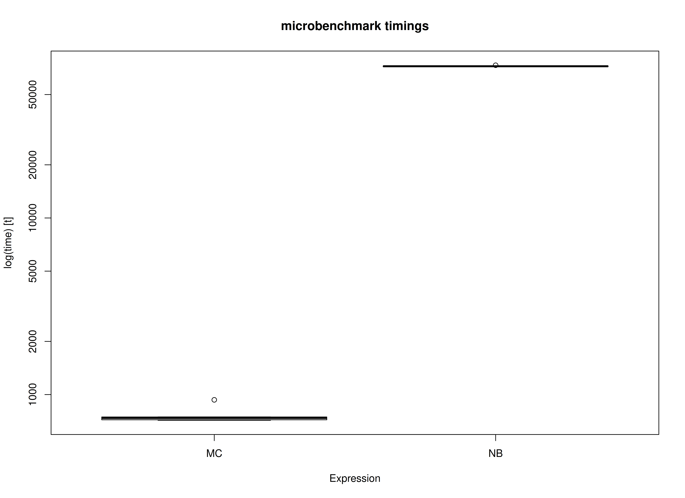
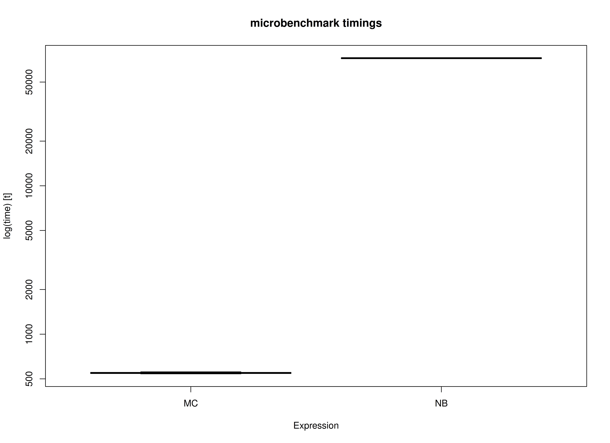

# Benchmark: Comparing the Monte Carlo Method with Nonparametric Bootstrapping (MI)

We compare the Monte Carlo (MC) method with nonparametric bootstrapping
(NB) using the simple mediation model with missing data using multiple
imputation. One advantage of MC over NB is speed. This is because the
model is only fitted once in MC whereas it is fitted many times in NB.

``` r

library(semmcci)
library(lavaan)
library(Amelia)
library(microbenchmark)
```

## Data

``` r

n <- 1000
a <- 0.50
b <- 0.50
cp <- 0.25
s2_em <- 1 - a^2
s2_ey <- 1 - cp^2 - a^2 * b^2 - b^2 * s2_em - 2 * cp * a * b
em <- rnorm(n = n, mean = 0, sd = sqrt(s2_em))
ey <- rnorm(n = n, mean = 0, sd = sqrt(s2_ey))
X <- rnorm(n = n)
M <- a * X + em
Y <- cp * X + b * M + ey
df <- data.frame(X, M, Y)

# Create data set with missing values.

miss <- sample(1:dim(df)[1], 300)
df[miss[1:100], "X"] <- NA
df[miss[101:200], "M"] <- NA
df[miss[201:300], "Y"] <- NA
```

## Multiple Imputation

Perform the appropriate multiple imputation approach to deal with
missing values. In this example, we impute multivariate missing data
under the normal model.

``` r

mi <- amelia(
  x = df,
  m = 5L,
  p2s = 0
)
```

## Model Specification

The indirect effect is defined by the product of the slopes of paths `X`
to `M` labeled as `a` and `M` to `Y` labeled as `b`. In this example, we
are interested in the confidence intervals of `indirect` defined as the
product of `a` and `b` using the `:=` operator in the `lavaan` model
syntax.

``` r

model <- "
  Y ~ cp * X + b * M
  M ~ a * X
  X ~~ X
  indirect := a * b
  direct := cp
  total := cp + (a * b)
"
```

## Model Fitting

We can now fit the model using the
[`sem()`](https://rdrr.io/pkg/lavaan/man/sem.html) function from
`lavaan`. We do not need to deal with missing values in this stage.

``` r

fit <- sem(data = df, model = model)
```

## Monte Carlo Confidence Intervals (Multiple Imputation)

The `fit` `lavaan` object and `mi` `mids` object can then be passed to
the [`MCMI()`](https://github.com/jeksterslab/semmcci/reference/MCMI.md)
function from `semmcci` to generate Monte Carlo confidence intervals
using multiple imputation as described in Pesigan and Cheung (2024).

``` r

MCMI(fit, R = 100L, alpha = 0.05, mi = mi)
#> Monte Carlo Confidence Intervals (Multiple Imputation Estimates)
#>             est     se   R   2.5%  97.5%
#> cp       0.2274 0.0295 100 0.1787 0.2818
#> b        0.5192 0.0342 100 0.4534 0.5839
#> a        0.4790 0.0281 100 0.4249 0.5266
#> X~~X     1.0613 0.0443 100 0.9775 1.1328
#> Y~~Y     0.5439 0.0244 100 0.5010 0.5911
#> M~~M     0.7642 0.0397 100 0.7048 0.8397
#> indirect 0.2486 0.0189 100 0.2103 0.2755
#> direct   0.2274 0.0295 100 0.1787 0.2818
#> total    0.4760 0.0288 100 0.4243 0.5329
```

## Nonparametric Bootstrap Confidence Intervals (Multiple Imputation)

Nonparametric bootstrap confidence intervals can be generated in
`bmemLavaan` using the following.

``` r

summary(
  bmemLavaan::bmem(data = df, model = model, method = "mi", boot = 100L, m = 5L)
)
#> 
#> Estimate method:                          multiple imputation
#> Sample size:                              1000      
#> Number of request bootstrap draws:        100       
#> Number of successful bootstrap draws:     100       
#> Type of confidence interval:              perc
#> 
#> Values of statistics:
#> 
#>                      Value      SE      2.5%     97.5%
#>   chisq               0.000    0.000    0.000    0.000   
#>   GFI                 1.000    0.000    1.000    1.000   
#>   AGFI                1.000    0.000    1.000    1.000   
#>   RMSEA               0.000    0.000    0.000    0.000   
#>   NFI                 1.000    0.000    1.000    1.000   
#>   NNFI                1.000    0.000    1.000    1.000   
#>   CFI                 1.000    0.000    1.000    1.000   
#>   BIC                 7742.967 81.777   7575.258 7857.675
#>   SRMR                0.000    0.000    0.000    0.000   
#> 
#> Estimation of parameters:
#> 
#>                      Estimate   SE      2.5%     97.5%
#> Regressions:
#>   Y ~
#>     X        (cp)     0.234    0.030    0.176    0.296
#>     M         (b)     0.513    0.032    0.460    0.570
#>   M ~
#>     X         (a)     0.476    0.030    0.426    0.540
#> 
#> Variances:
#>     X                 1.057    0.046    0.950    1.144
#>     Y                 0.556    0.027    0.488    0.600
#>     M                 0.755    0.035    0.684    0.813
#> 
#> 
#> 
#> Defined parameters:
#>     a*b    (indr)     0.244    0.020    0.206    0.285
#>     cp     (drct)     0.234    0.030    0.176    0.296
#>     cp+(*) (totl)     0.479    0.030    0.428    0.539
```

## Benchmark

### Arguments

| Variables | Values | Notes                               |
|:----------|:-------|:------------------------------------|
| R         | 100    | Number of Monte Carlo replications. |
| B         | 100    | Number of bootstrap samples.        |
| m         | 5      | Number of imputations.              |

## Benchmark

``` r

benchmark_mi_01 <- microbenchmark(
  MC = {
    fit <- sem(
      data = df,
      model = model
    )
    mi <- Amelia::amelia(
      x = df,
      m = m,
      p2s = 0
    )
    MCMI(
      fit,
      R = R,
      decomposition = "chol",
      pd = FALSE,
      mi = mi
    )
  },
  NB = bmemLavaan::bmem(
    data = df,
    model = model,
    method = "mi",
    boot = B,
    m = m
  ),
  times = 10
)
```

### Summary of Benchmark Results

``` r

summary(benchmark_mi_01, unit = "ms")
#>   expr        min         lq      mean   median         uq        max neval
#> 1   MC   714.9348   719.4493   753.607   737.44   746.9044   933.4056    10
#> 2   NB 71749.4791 72082.4629 72354.947 72310.45 72488.2285 73271.0202    10
```

### Summary of Benchmark Results Relative to the Faster Method

``` r

summary(benchmark_mi_01, unit = "relative")
#>   expr      min       lq     mean   median       uq      max neval
#> 1   MC   1.0000   1.0000  1.00000  1.00000  1.00000  1.00000    10
#> 2   NB 100.3581 100.1912 96.01151 98.05604 97.05155 78.49859    10
```

## Plot



## Benchmark - Monte Carlo Method with Precalculated Estimates and Multiple Imputation

``` r

fit <- sem(
  data = df,
  model = model
)
mi <- Amelia::amelia(
  x = df,
  m = m,
  p2s = 0
)
benchmark_mi_02 <- microbenchmark(
  MC = MCMI(
    fit,
    R = R,
    decomposition = "chol",
    pd = FALSE,
    mi = mi
  ),
  NB = bmemLavaan::bmem(
    data = df,
    model = model,
    method = "mi",
    boot = B,
    m = m
  ),
  times = 10
)
```

### Summary of Benchmark Results

``` r

summary(benchmark_mi_02, unit = "ms")
#>   expr        min         lq       mean     median         uq        max neval
#> 1   MC   540.1188   543.1085   548.4491   547.7864   553.0569   558.0039    10
#> 2   NB 72096.5023 72292.0301 72413.8396 72434.4786 72575.3305 72588.6181    10
```

### Summary of Benchmark Results Relative to the Faster Method

``` r

summary(benchmark_mi_02, unit = "relative")
#>   expr      min       lq     mean   median       uq      max neval
#> 1   MC   1.0000   1.0000   1.0000   1.0000   1.0000   1.0000    10
#> 2   NB 133.4827 133.1079 132.0338 132.2313 131.2258 130.0862    10
```

## Plot



## References

Pesigan, I. J. A., & Cheung, S. F. (2024). Monte Carlo confidence
intervals for the indirect effect with missing data. *Behavior Research
Methods*, *56*(3), 1678–1696.
<https://doi.org/10.3758/s13428-023-02114-4>
