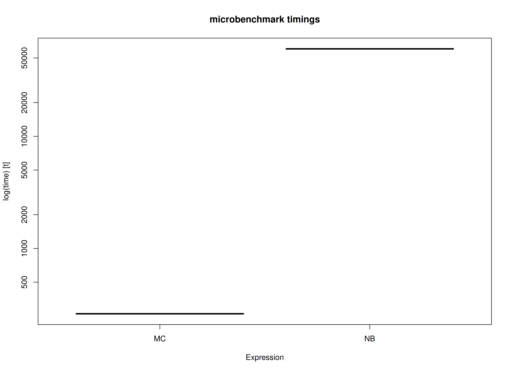
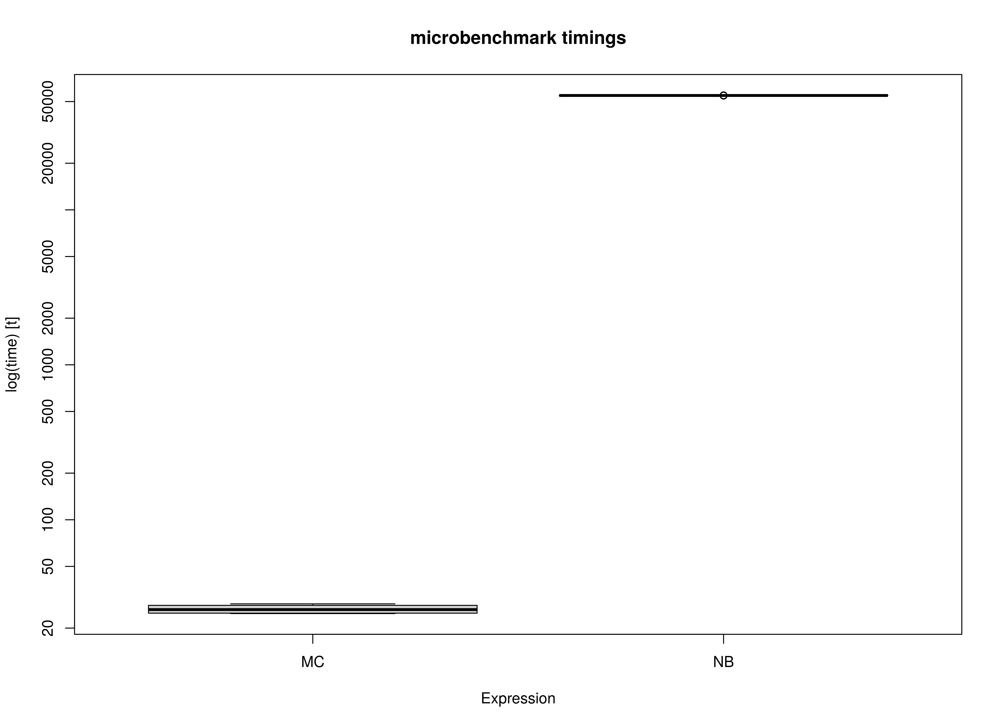

<!-- vignettes/benchmark-complete.Rmd is generated from .setup/vignettes/benchmark-complete.Rmd.orig. Please edit that file -->


We compare the Monte Carlo (MC) method with nonparametric bootstrapping (NB) using the simple mediation model with complete data.
One advantage of MC over NB is speed.
This is because the model is only fitted once in MC whereas it is fitted many times in NB.


```r
library(semmcci)
library(lavaan)
library(microbenchmark)
```

## Data


```r
n <- 1000
a <- 0.50
b <- 0.50
cp <- 0.25
s2_em <- 1 - a^2
s2_ey <- 1 - cp^2 - a^2 * b^2 - b^2 * s2_em - 2 * cp * a * b
em <- rnorm(n = n, mean = 0, sd = sqrt(s2_em))
ey <- rnorm(n = n, mean = 0, sd = sqrt(s2_ey))
X <- rnorm(n = n)
M <- a * X + em
Y <- cp * X + b * M + ey
df <- data.frame(X, M, Y)
```

## Model Specification

The indirect effect is defined by the product of the slopes
of paths `X` to `M` labeled as `a` and `M` to `Y` labeled as `b`.
In this example, we are interested in the confidence intervals of `indirect`
defined as the product of `a` and `b` using the `:=` operator
in the `lavaan` model syntax.


```r
model <- "
  Y ~ cp * X + b * M
  M ~ a * X
  X ~~ X
  indirect := a * b
  direct := cp
  total := cp + (a * b)
"
```

## Model Fitting

We can now fit the model using the `sem()` function from `lavaan`.


```r
fit <- sem(data = df, model = model)
```

## Monte Carlo Confidence Intervals

The `fit` `lavaan` object can then be passed to the `MC()` function from `semmcci`
to generate Monte Carlo confidence intervals.


```r
MC(fit, R = 100L, alpha = 0.05)
#> Monte Carlo Confidence Intervals
#>             est     se   R   2.5%  97.5%
#> cp       0.2333 0.0296 100 0.1806 0.2903
#> b        0.5082 0.0279 100 0.4555 0.5527
#> a        0.4820 0.0280 100 0.4220 0.5301
#> X~~X     1.0590 0.0426 100 0.9751 1.1296
#> Y~~Y     0.5462 0.0231 100 0.5064 0.5959
#> M~~M     0.7527 0.0337 100 0.7024 0.8208
#> indirect 0.2449 0.0179 100 0.2058 0.2738
#> direct   0.2333 0.0296 100 0.1806 0.2903
#> total    0.4782 0.0295 100 0.4162 0.5283
```

## Nonparametric Bootstrap Confidence Intervals

Nonparametric bootstrap confidence intervals can be generated in `lavaan` using the following.


```r
parameterEstimates(
  sem(
    data = df,
    model = model,
    se = "bootstrap",
    bootstrap = 100L
  )
)
#>        lhs op      rhs    label   est    se      z pvalue ci.lower ci.upper
#> 1        Y  ~        X       cp 0.233 0.025  9.395      0    0.183    0.278
#> 2        Y  ~        M        b 0.508 0.028 18.057      0    0.454    0.568
#> 3        M  ~        X        a 0.482 0.026 18.550      0    0.433    0.535
#> 4        X ~~        X          1.059 0.046 23.224      0    0.969    1.161
#> 5        Y ~~        Y          0.546 0.023 23.640      0    0.508    0.593
#> 6        M ~~        M          0.753 0.033 23.131      0    0.692    0.814
#> 7 indirect :=      a*b indirect 0.245 0.020 12.381      0    0.209    0.289
#> 8   direct :=       cp   direct 0.233 0.025  9.348      0    0.183    0.278
#> 9    total := cp+(a*b)    total 0.478 0.027 17.876      0    0.418    0.518
```

## Benchmark

### Arguments


|Variables |Values |Notes                               |
|:---------|:------|:-----------------------------------|
|R         |1000   |Number of Monte Carlo replications. |
|B         |1000   |Number of bootstrap samples.        |


```r
benchmark_complete_01 <- microbenchmark(
  MC = {
    fit <- sem(
      data = df,
      model = model
    )
    MC(
      fit,
      R = R,
      decomposition = "chol",
      pd = FALSE
    )
  },
  NB = sem(
    data = df,
    model = model,
    se = "bootstrap",
    bootstrap = B
  ),
  times = 10
)
```

### Summary of Benchmark Results


```r
summary(benchmark_complete_01, unit = "ms")
#>   expr        min         lq        mean    median          uq         max
#> 1   MC   69.73834   70.75089    79.11454   82.5218    83.94272    84.11892
#> 2   NB 9147.98459 9217.61173 11006.09423 9574.8787 13479.15610 13613.64003
#>   neval
#> 1    10
#> 2    10
```

### Summary of Benchmark Results Relative to the Faster Method


```r
summary(benchmark_complete_01, unit = "relative")
#>   expr      min       lq    mean   median       uq     max neval
#> 1   MC   1.0000   1.0000   1.000   1.0000   1.0000   1.000    10
#> 2   NB 131.1758 130.2826 139.116 116.0285 160.5757 161.838    10
```

## Plot



## Benchmark - Monte Carlo Method with Precalculated Estimates


```r
fit <- sem(
  data = df,
  model = model
)
benchmark_complete_02 <- microbenchmark(
  MC = MC(
    fit,
    R = R,
    decomposition = "chol",
    pd = FALSE
  ),
  NB = sem(
    data = df,
    model = model,
    se = "bootstrap",
    bootstrap = B
  ),
  times = 10
)
```

### Summary of Benchmark Results


```r
summary(benchmark_complete_02, unit = "ms")
#>   expr        min         lq       mean   median         uq        max neval
#> 1   MC   15.00316   15.23893   16.03242   15.355   17.31358   17.75707    10
#> 2   NB 9157.01927 9179.26383 9194.24200 9191.338 9202.08534 9239.40366    10
```

### Summary of Benchmark Results Relative to the Faster Method


```r
summary(benchmark_complete_02, unit = "relative")
#>   expr      min       lq     mean   median       uq      max neval
#> 1   MC   1.0000   1.0000   1.0000   1.0000   1.0000   1.0000    10
#> 2   NB 610.3392 602.3564 573.4782 598.5892 531.4952 520.3226    10
```

## Plot



## References
