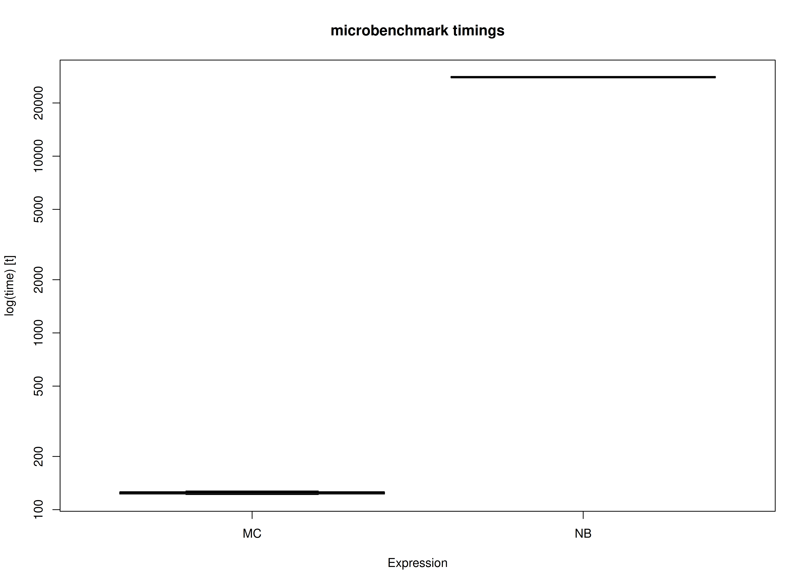

<!-- vignettes/benchmark-complete.Rmd is generated from .setup/vignettes/benchmark-complete.Rmd.orig. Please edit that file -->


We compare the Monte Carlo (MC) method with nonparametric bootstrapping (NB) using the simple mediation model with complete data.
One advantage of MC over NB is speed.
This is because the model is only fitted once in MC whereas it is fitted many times in NB.


```r
library(semmcci)
library(lavaan)
library(microbenchmark)
```

## Data


```r
n <- 1000
a <- 0.50
b <- 0.50
cp <- 0.25
s2_em <- 1 - a^2
s2_ey <- 1 - cp^2 - a^2 * b^2 - b^2 * s2_em - 2 * cp * a * b
em <- rnorm(n = n, mean = 0, sd = sqrt(s2_em))
ey <- rnorm(n = n, mean = 0, sd = sqrt(s2_ey))
X <- rnorm(n = n)
M <- a * X + em
Y <- cp * X + b * M + ey
df <- data.frame(X, M, Y)
```

## Model Specification

The indirect effect is defined by the product of the slopes
of paths `X` to `M` labeled as `a` and `M` to `Y` labeled as `b`.
In this example, we are interested in the confidence intervals of `indirect`
defined as the product of `a` and `b` using the `:=` operator
in the `lavaan` model syntax.


```r
model <- "
  Y ~ cp * X + b * M
  M ~ a * X
  X ~~ X
  indirect := a * b
  direct := cp
  total := cp + (a * b)
"
```

## Model Fitting

We can now fit the model using the `sem()` function from `lavaan`.


```r
fit <- sem(data = df, model = model)
```

## Monte Carlo Confidence Intervals

The `fit` `lavaan` object can then be passed to the `MC()` function from `semmcci`
to generate Monte Carlo confidence intervals.


```r
MC(fit, R = 100L, alpha = 0.05)
#> Monte Carlo Confidence Intervals
#>             est     se   R   2.5%  97.5%
#> cp       0.2333 0.0257 100 0.1943 0.2875
#> b        0.5082 0.0242 100 0.4611 0.5572
#> a        0.4820 0.0257 100 0.4354 0.5366
#> X~~X     1.0590 0.0497 100 0.9767 1.1702
#> Y~~Y     0.5462 0.0240 100 0.4980 0.5915
#> M~~M     0.7527 0.0336 100 0.6952 0.8143
#> indirect 0.2449 0.0172 100 0.2145 0.2745
#> direct   0.2333 0.0257 100 0.1943 0.2875
#> total    0.4782 0.0291 100 0.4278 0.5380
```

## Nonparametric Bootstrap Confidence Intervals

Nonparametric bootstrap confidence intervals can be generated in `lavaan` using the following.


```r
parameterEstimates(
  sem(
    data = df,
    model = model,
    se = "bootstrap",
    bootstrap = 100L
  )
)
#>        lhs op      rhs    label   est    se      z pvalue ci.lower ci.upper
#> 1        Y  ~        X       cp 0.233 0.025  9.295      0    0.179    0.278
#> 2        Y  ~        M        b 0.508 0.029 17.228      0    0.451    0.565
#> 3        M  ~        X        a 0.482 0.028 17.494      0    0.432    0.540
#> 4        X ~~        X          1.059 0.051 20.633      0    0.952    1.163
#> 5        Y ~~        Y          0.546 0.026 21.349      0    0.500    0.599
#> 6        M ~~        M          0.753 0.036 20.693      0    0.681    0.827
#> 7 indirect :=      a*b indirect 0.245 0.019 12.821      0    0.212    0.292
#> 8   direct :=       cp   direct 0.233 0.025  9.249      0    0.179    0.278
#> 9    total := cp+(a*b)    total 0.478 0.026 18.464      0    0.425    0.530
```

## Benchmark

### Arguments


|Variables |Values |Notes                               |
|:---------|:------|:-----------------------------------|
|R         |1000   |Number of Monte Carlo replications. |
|B         |1000   |Number of bootstrap samples.        |


```r
benchmark_complete_01 <- microbenchmark(
  MC = {
    fit <- sem(
      data = df,
      model = model
    )
    MC(
      fit,
      R = R,
      decomposition = "chol",
      pd = FALSE
    )
  },
  NB = sem(
    data = df,
    model = model,
    se = "bootstrap",
    bootstrap = B
  ),
  times = 10
)
```

### Summary of Benchmark Results


```r
summary(benchmark_complete_01, unit = "ms")
#>   expr        min         lq        mean     median         uq       max neval
#> 1   MC    60.5147    62.1197    63.58024    64.2439    64.6262    65.778    10
#> 2   NB 10894.2301 10899.4002 10998.03753 10950.8393 11060.7333 11245.056    10
```

### Summary of Benchmark Results Relative to the Faster Method


```r
summary(benchmark_complete_01, unit = "relative")
#>   expr      min      lq     mean   median       uq      max neval
#> 1   MC   1.0000   1.000   1.0000   1.0000   1.0000   1.0000    10
#> 2   NB 180.0262 175.458 172.9789 170.4573 171.1494 170.9547    10
```

## Plot



## Benchmark - Monte Carlo Method with Precalculated Estimates


```r
fit <- sem(
  data = df,
  model = model
)
benchmark_complete_02 <- microbenchmark(
  MC = MC(
    fit,
    R = R,
    decomposition = "chol",
    pd = FALSE
  ),
  NB = sem(
    data = df,
    model = model,
    se = "bootstrap",
    bootstrap = B
  ),
  times = 10
)
```

### Summary of Benchmark Results


```r
summary(benchmark_complete_02, unit = "ms")
#>   expr        min         lq        mean      median         uq        max
#> 1   MC    18.3155    18.5246    19.72051    18.72505    21.8925    22.7626
#> 2   NB 10899.0503 10913.9385 10946.01251 10943.65850 10968.3209 11034.4362
#>   neval
#> 1    10
#> 2    10
```

### Summary of Benchmark Results Relative to the Faster Method


```r
summary(benchmark_complete_02, unit = "relative")
#>   expr      min       lq     mean   median       uq      max neval
#> 1   MC   1.0000   1.0000   1.0000   1.0000   1.0000   1.0000    10
#> 2   NB 595.0725 589.1592 555.0573 584.4395 501.0081 484.7617    10
```

## Plot


## References
