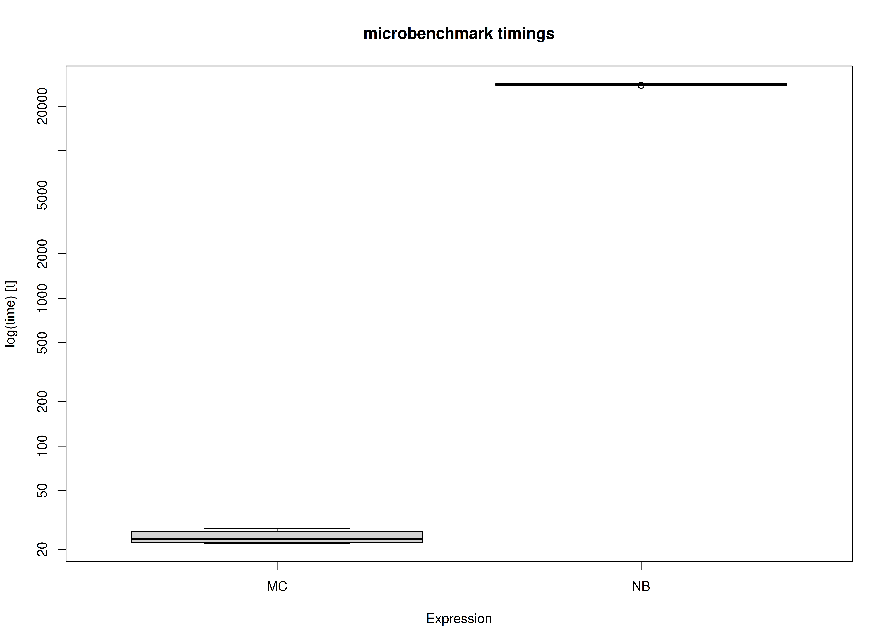

<!-- vignettes/benchmark-fiml.Rmd is generated from .setup/vignettes/benchmark-fiml.Rmd.orig. Please edit that file -->


We compare the Monte Carlo (MC) method with nonparametric bootstrapping (NB) using the simple mediation model with missing data
using full-information maximum likelihood.
One advantage of MC over NB is speed.
This is because the model is only fitted once in MC whereas it is fitted many times in NB.


```r
library(semmcci)
library(lavaan)
library(microbenchmark)
```

## Data


```r
n <- 1000
a <- 0.50
b <- 0.50
cp <- 0.25
s2_em <- 1 - a^2
s2_ey <- 1 - cp^2 - a^2 * b^2 - b^2 * s2_em - 2 * cp * a * b
em <- rnorm(n = n, mean = 0, sd = sqrt(s2_em))
ey <- rnorm(n = n, mean = 0, sd = sqrt(s2_ey))
X <- rnorm(n = n)
M <- a * X + em
Y <- cp * X + b * M + ey
df <- data.frame(X, M, Y)

# Create data set with missing values.

miss <- sample(1:dim(df)[1], 300)
df[miss[1:100], "X"] <- NA
df[miss[101:200], "M"] <- NA
df[miss[201:300], "Y"] <- NA
```

## Model Specification

The indirect effect is defined by the product of the slopes
of paths `X` to `M` labeled as `a` and `M` to `Y` labeled as `b`.
In this example, we are interested in the confidence intervals of `indirect`
defined as the product of `a` and `b` using the `:=` operator
in the `lavaan` model syntax.


```r
model <- "
  Y ~ cp * X + b * M
  M ~ a * X
  X ~~ X
  indirect := a * b
  direct := cp
  total := cp + (a * b)
"
```

## Model Fitting

We can now fit the model using the `sem()` function from `lavaan`.
We are using `missing = "fiml"` to handle missing data in `lavaan`.


```r
fit <- sem(data = df, model = model)
```

## Monte Carlo Confidence Intervals

The `fit` `lavaan` object can then be passed to the `MC()` function from `semmcci`
to generate Monte Carlo confidence intervals.


```r
MC(fit, R = 100L, alpha = 0.05)
#> Monte Carlo Confidence Intervals
#>             est     se   R   2.5%  97.5%
#> cp       0.2419 0.0312 100 0.1890 0.3024
#> b        0.5166 0.0278 100 0.4573 0.5722
#> a        0.4989 0.0358 100 0.4259 0.5587
#> X~~X     1.0951 0.0591 100 0.9948 1.2245
#> Y~~Y     0.5796 0.0297 100 0.5236 0.6336
#> M~~M     0.8045 0.0432 100 0.7245 0.8871
#> indirect 0.2577 0.0251 100 0.2084 0.3151
#> direct   0.2419 0.0312 100 0.1890 0.3024
#> total    0.4996 0.0329 100 0.4486 0.5677
```

## Nonparametric Bootstrap Confidence Intervals

Nonparametric bootstrap confidence intervals can be generated in `lavaan` using the following.


```r
parameterEstimates(
  sem(
    data = df,
    model = model,
    missing = "fiml",
    se = "bootstrap",
    bootstrap = 100L
  )
)
#>         lhs op      rhs    label    est    se      z pvalue ci.lower ci.upper
#> 1         Y  ~        X       cp  0.234 0.031  7.594  0.000    0.170    0.293
#> 2         Y  ~        M        b  0.511 0.027 18.594  0.000    0.453    0.559
#> 3         M  ~        X        a  0.481 0.027 17.933  0.000    0.411    0.522
#> 4         X ~~        X           1.059 0.052 20.178  0.000    0.945    1.151
#> 5         Y ~~        Y           0.554 0.026 21.029  0.000    0.504    0.609
#> 6         M ~~        M           0.756 0.036 20.805  0.000    0.675    0.836
#> 7         Y ~1                   -0.013 0.026 -0.493  0.622   -0.077    0.030
#> 8         M ~1                   -0.022 0.030 -0.741  0.459   -0.093    0.051
#> 9         X ~1                    0.002 0.035  0.071  0.943   -0.063    0.076
#> 10 indirect :=      a*b indirect  0.246 0.019 12.899  0.000    0.198    0.276
#> 11   direct :=       cp   direct  0.234 0.031  7.555  0.000    0.170    0.293
#> 12    total := cp+(a*b)    total  0.479 0.029 16.467  0.000    0.409    0.543
```

## Benchmark

### Arguments


|Variables |Values |Notes                               |
|:---------|:------|:-----------------------------------|
|R         |1000   |Number of Monte Carlo replications. |
|B         |1000   |Number of bootstrap samples.        |


```r
benchmark_fiml_01 <- microbenchmark(
  MC = {
    fit <- sem(
      data = df,
      model = model,
      missing = "fiml"
    )
    MC(
      fit,
      R = R,
      decomposition = "chol",
      pd = FALSE
    )
  },
  NB = sem(
    data = df,
    model = model,
    missing = "fiml",
    se = "bootstrap",
    bootstrap = B
  ),
  times = 10
)
```

### Summary of Benchmark Results


```r
summary(benchmark_fiml_01, unit = "ms")
#>   expr        min         lq       mean     median         uq        max neval
#> 1   MC   123.8444   126.0288   128.7082   129.7413   130.5679   132.1679    10
#> 2   NB 31896.5324 32221.8304 32381.2732 32438.9237 32611.7284 32687.5752    10
```

### Summary of Benchmark Results Relative to the Faster Method


```r
summary(benchmark_fiml_01, unit = "relative")
#>   expr      min       lq     mean   median       uq      max neval
#> 1   MC   1.0000   1.0000   1.0000   1.0000   1.0000   1.0000    10
#> 2   NB 257.5533 255.6704 251.5868 250.0277 249.7683 247.3186    10
```

## Plot


## Benchmark - Monte Carlo Method with Precalculated Estimates


```r
fit <- sem(
  data = df,
  model = model,
  missing = "fiml"
)
benchmark_fiml_02 <- microbenchmark(
  MC = MC(
    fit,
    R = R,
    decomposition = "chol",
    pd = FALSE
  ),
  NB = sem(
    data = df,
    model = model,
    missing = "fiml",
    se = "bootstrap",
    bootstrap = B
  ),
  times = 10
)
```

### Summary of Benchmark Results


```r
summary(benchmark_fiml_02, unit = "ms")
#>   expr        min         lq        mean      median         uq        max
#> 1   MC    22.6437    23.0384    25.16276    23.67305    26.7331    31.2814
#> 2   NB 29935.0332 30006.9414 31161.12040 30919.59445 32424.1010 32662.8819
#>   neval
#> 1    10
#> 2    10
```

### Summary of Benchmark Results Relative to the Faster Method


```r
summary(benchmark_fiml_02, unit = "relative")
#>   expr      min       lq     mean   median       uq      max neval
#> 1   MC    1.000    1.000    1.000    1.000    1.000    1.000    10
#> 2   NB 1322.003 1302.475 1238.382 1306.109 1212.882 1044.163    10
```

## Plot



## References
