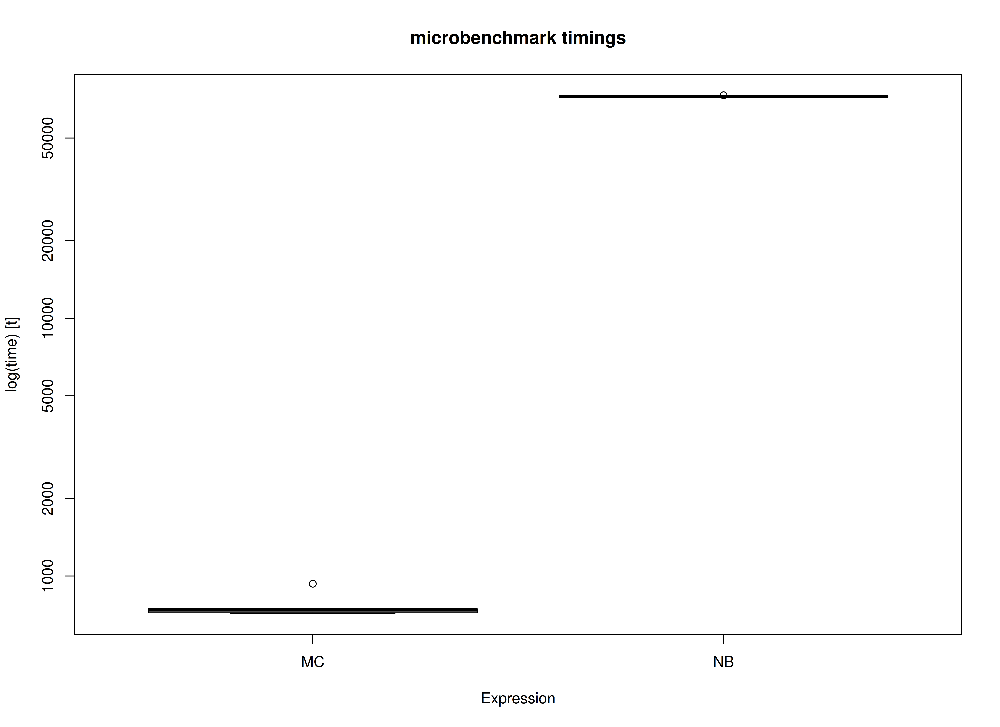
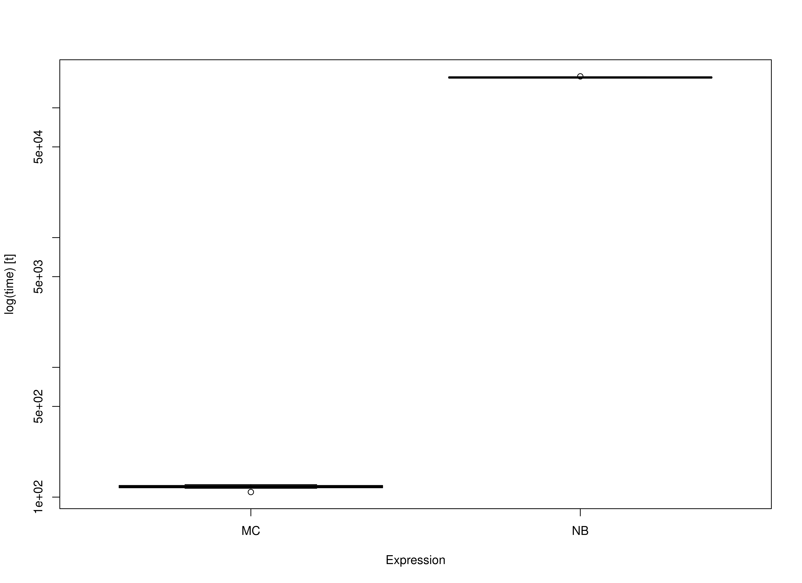

<!-- vignettes/benchmark-mi.Rmd is generated from .setup/vignettes/benchmark-mi.Rmd.orig. Please edit that file -->


We compare the Monte Carlo (MC) method with nonparametric bootstrapping (NB) using the simple mediation model with missing data
using multiple imputation.
One advantage of MC over NB is speed.
This is because the model is only fitted once in MC whereas it is fitted many times in NB.


```r
library(semmcci)
library(lavaan)
library(Amelia)
library(microbenchmark)
```

## Data


```r
n <- 1000
a <- 0.50
b <- 0.50
cp <- 0.25
s2_em <- 1 - a^2
s2_ey <- 1 - cp^2 - a^2 * b^2 - b^2 * s2_em - 2 * cp * a * b
em <- rnorm(n = n, mean = 0, sd = sqrt(s2_em))
ey <- rnorm(n = n, mean = 0, sd = sqrt(s2_ey))
X <- rnorm(n = n)
M <- a * X + em
Y <- cp * X + b * M + ey
df <- data.frame(X, M, Y)

# Create data set with missing values.

miss <- sample(1:dim(df)[1], 300)
df[miss[1:100], "X"] <- NA
df[miss[101:200], "M"] <- NA
df[miss[201:300], "Y"] <- NA
```

## Multiple Imputation

Perform the appropriate multiple imputation approach to deal with missing values.
In this example, we impute multivariate missing data under the normal model.


```r
mi <- amelia(
  x = df,
  m = 5L,
  p2s = 0
)
```

## Model Specification

The indirect effect is defined by the product of the slopes
of paths `X` to `M` labeled as `a` and `M` to `Y` labeled as `b`.
In this example, we are interested in the confidence intervals of `indirect`
defined as the product of `a` and `b` using the `:=` operator
in the `lavaan` model syntax.


```r
model <- "
  Y ~ cp * X + b * M
  M ~ a * X
  X ~~ X
  indirect := a * b
  direct := cp
  total := cp + (a * b)
"
```

## Model Fitting

We can now fit the model using the `sem()` function from `lavaan`.
We do not need to deal with missing values in this stage.


```r
fit <- sem(data = df, model = model)
```

## Monte Carlo Confidence Intervals (Multiple Imputation)

The `fit` `lavaan` object and `mi` `mids` object can then be passed to the `MCMI()` function from `semmcci`
to generate Monte Carlo confidence intervals
using multiple imputation
as described in Pesigan and Cheung (2023).


```r
MCMI(fit, R = 100L, alpha = 0.05, mi = mi)
#> Monte Carlo Confidence Intervals (Multiple Imputation Estimates)
#>             est     se   R   2.5%  97.5%
#> cp       0.2274 0.0339 100 0.1630 0.2835
#> b        0.5192 0.0350 100 0.4578 0.5868
#> a        0.4790 0.0302 100 0.4212 0.5261
#> X~~X     1.0613 0.0477 100 0.9525 1.1456
#> Y~~Y     0.5439 0.0268 100 0.4906 0.5866
#> M~~M     0.7642 0.0396 100 0.6812 0.8395
#> indirect 0.2486 0.0210 100 0.2109 0.2900
#> direct   0.2274 0.0339 100 0.1630 0.2835
#> total    0.4760 0.0322 100 0.4103 0.5383
```

## Nonparametric Bootstrap Confidence Intervals (Multiple Imputation)

Nonparametric bootstrap confidence intervals can be generated in `bmemLavaan` using the following.


```r
summary(
  bmemLavaan::bmem(data = df, model = model, method = "mi", boot = 100L, m = 5L)
)
#> 
#> Estimate method:                          multiple imputation
#> Sample size:                              1000      
#> Number of request bootstrap draws:        100       
#> Number of successful bootstrap draws:     100       
#> Type of confidence interval:              perc
#> 
#> Values of statistics:
#> 
#>                      Value      SE      2.5%     97.5%
#>   chisq               0.000    0.000    0.000    0.000   
#>   GFI                 1.000    0.000    1.000    1.000   
#>   AGFI                1.000    0.000    1.000    1.000   
#>   RMSEA               0.000    0.000    0.000    0.000   
#>   NFI                 1.000    0.000    1.000    1.000   
#>   NNFI                1.000    0.000    1.000    1.000   
#>   CFI                 1.000    0.000    1.000    1.000   
#>   BIC                 7747.123 87.148   7587.711 7901.058
#>   SRMR                0.000    0.000    0.000    0.000   
#> 
#> Estimation of parameters:
#> 
#>                      Estimate   SE      2.5%     97.5%
#> Regressions:
#>   Y ~
#>     X        (cp)     0.233    0.034    0.159    0.295
#>     M         (b)     0.509    0.030    0.462    0.564
#>   M ~
#>     X         (a)     0.477    0.026    0.428    0.527
#> 
#> Variances:
#>     X                 1.058    0.056    0.970    1.155
#>     Y                 0.559    0.028    0.498    0.606
#>     M                 0.754    0.038    0.692    0.831
#> 
#> 
#> 
#> Defined parameters:
#>     a*b    (indr)     0.243    0.019    0.215    0.289
#>     cp     (drct)     0.233    0.034    0.159    0.295
#>     cp+(*) (totl)     0.476    0.030    0.421    0.539
```

## Benchmark

### Arguments


|Variables |Values |Notes                               |
|:---------|:------|:-----------------------------------|
|R         |100    |Number of Monte Carlo replications. |
|B         |100    |Number of bootstrap samples.        |
|m         |5      |Number of imputations.              |


## Benchmark


```r
benchmark_mi_01 <- microbenchmark(
  MC = {
    fit <- sem(
      data = df,
      model = model
    )
    mi <- Amelia::amelia(
      x = df,
      m = m,
      p2s = 0
    )
    MCMI(
      fit,
      R = R,
      decomposition = "chol",
      pd = FALSE,
      mi = mi
    )
  },
  NB = bmemLavaan::bmem(
    data = df,
    model = model,
    method = "mi",
    boot = B,
    m = m
  ),
  times = 10
)
```

### Summary of Benchmark Results


```r
summary(benchmark_mi_01, unit = "ms")
#>   expr        min         lq       mean     median         uq        max neval
#> 1   MC   390.2627   399.6398   408.8165   407.1492   412.9314   439.4626    10
#> 2   NB 38325.9037 38553.5319 38716.4634 38657.2532 38739.6398 39215.8814    10
```

### Summary of Benchmark Results Relative to the Faster Method


```r
summary(benchmark_mi_01, unit = "relative")
#>   expr     min      lq     mean   median       uq      max neval
#> 1   MC  1.0000  1.0000  1.00000  1.00000  1.00000  1.00000    10
#> 2   NB 98.2054 96.4707 94.70377 94.94616 93.81616 89.23599    10
```

## Plot



## Benchmark - Monte Carlo Method with Precalculated Estimates and Multiple Imputation


```r
fit <- sem(
  data = df,
  model = model
)
mi <- Amelia::amelia(
  x = df,
  m = m,
  p2s = 0
)
benchmark_mi_02 <- microbenchmark(
  MC = MCMI(
    fit,
    R = R,
    decomposition = "chol",
    pd = FALSE,
    mi = mi
  ),
  NB = bmemLavaan::bmem(
    data = df,
    model = model,
    method = "mi",
    boot = B,
    m = m
  ),
  times = 10
)
```

### Summary of Benchmark Results


```r
summary(benchmark_mi_02, unit = "ms")
#>   expr        min         lq      mean    median         uq        max neval
#> 1   MC   264.4783   270.9132   274.962   275.918   279.4881   280.4398    10
#> 2   NB 38927.3737 39126.9471 39251.192 39252.451 39399.0801 39617.5386    10
```

### Summary of Benchmark Results Relative to the Faster Method


```r
summary(benchmark_mi_02, unit = "relative")
#>   expr      min       lq     mean   median       uq      max neval
#> 1   MC   1.0000   1.0000   1.0000   1.0000   1.0000   1.0000    10
#> 2   NB 147.1855 144.4261 142.7513 142.2613 140.9687 141.2693    10
```

## Plot



## References
