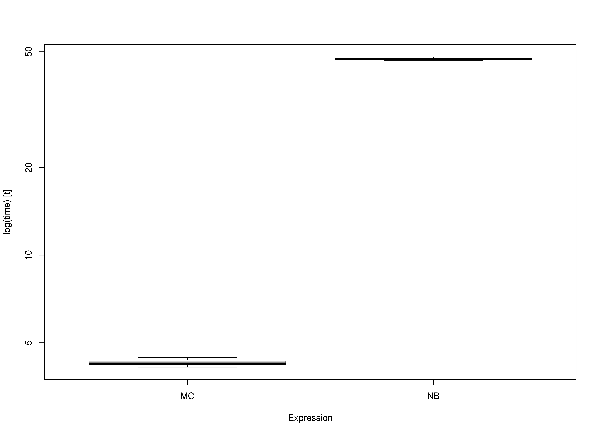

We compare the Monte Carlo (MC) method with nonparametric bootstrapping (NB) using the simple mediation model with missing data
using multiple imputation.
One advantage of MC over NB is speed.
This is because the model is only fitted once in MC whereas it is fitted many times in NB.


```r
library(semmcci)
library(lavaan)
library(microbenchmark)
```

## Data


```r
n <- 1000
a <- 0.50
b <- 0.50
cp <- 0.25
s2_em <- 1 - a^2
s2_ey <- 1 - cp^2 - a^2 * b^2 - b^2 * s2_em - 2 * cp * a * b
em <- rnorm(n = n, mean = 0, sd = sqrt(s2_em))
ey <- rnorm(n = n, mean = 0, sd = sqrt(s2_ey))
X <- rnorm(n = n)
M <- a * X + em
Y <- cp * X + b * M + ey
df <- data.frame(X, M, Y)

# Create data set with missing values.

miss <- sample(1:dim(df)[1], 300)
df[miss[1:100], "X"] <- NA
df[miss[101:200], "M"] <- NA
df[miss[201:300], "Y"] <- NA
```

## Model Specification

The indirect effect is defined by the product of the slopes
of paths `X` to `M` labeled as `a` and `M` to `Y` labeled as `b`.
In this example, we are interested in the confidence intervals of `indirect`
defined as the product of `a` and `b` using the `:=` operator
in the `lavaan` model syntax.


```r
model <- "
  Y ~ cp * X + b * M
  M ~ a * X
  X ~~ X
  indirect := a * b
  direct := cp
  total := cp + (a * b)
"
```

## Model Fitting

We can now fit the model using the `sem()` function from `lavaan`.


```r
fit <- sem(data = df, model = model)
```

## Monte Carlo Confidence Intervals (Multiple Imputation)

The `fit` `lavaan` object can then be passed to the `MCMI()` function from `semmcci`
to generate Monte Carlo confidence intervals.


```r
MCMI(fit, R = 100L, alpha = 0.05, m = 5L)
#> Monte Carlo Confidence Intervals
#>             est     se   R   2.5%  97.5%
#> cp       0.2390 0.0336 100 0.1732 0.2942
#> b        0.5054 0.0306 100 0.4495 0.5508
#> a        0.4846 0.0306 100 0.4319 0.5373
#> X~~X     1.0689 0.0513 100 0.9648 1.1605
#> Y~~Y     0.5629 0.0265 100 0.5110 0.6156
#> M~~M     0.7484 0.0363 100 0.6819 0.8079
#> indirect 0.2449 0.0219 100 0.1981 0.2827
#> direct   0.2390 0.0336 100 0.1732 0.2942
#> total    0.4839 0.0309 100 0.4200 0.5342
```

## Nonparametric Bootstrap Confidence Intervals (Multiple Imputation)

Nonparametric bootstrap confidence intervals can be generated in `bmemLavaan` using the following.


```r
summary(
  bmemLavaan::bmem(data = df, model = model, boot = 100L, m = 5L)
)
#> 
#> Estimate method:                          listwise deletion
#> Sample size:                              1000      
#> Number of request bootstrap draws:        100       
#> Number of successful bootstrap draws:     100       
#> Type of confidence interval:              perc
#> 
#> Values of statistics:
#> 
#>                      Value      SE      2.5%     97.5%
#>   chisq               0.000    0.000    0.000    0.000   
#>   GFI                 1.000    0.000    1.000    1.000   
#>   AGFI                1.000    0.000    1.000    1.000   
#>   RMSEA               0.000    0.000    0.000    0.000   
#>   NFI                 1.000    0.000    1.000    1.000   
#>   NNFI                1.000    0.000    1.000    1.000   
#>   CFI                 1.000    0.000    1.000    1.000   
#>   BIC                 7884.178 94.052   7694.322 8058.690
#>   SRMR                0.000    0.000    0.000    0.000   
#> 
#> Estimation of parameters:
#> 
#>                      Estimate   SE      2.5%     97.5%
#> Regressions:
#>   Y ~
#>     X        (cp)     0.242    0.031    0.181    0.298
#>     M         (b)     0.517    0.031    0.451    0.574
#>   M ~
#>     X         (a)     0.499    0.028    0.458    0.555
#> 
#> Variances:
#>     X                 1.096    0.064    0.994    1.208
#>     Y                 0.580    0.034    0.531    0.650
#>     M                 0.805    0.044    0.717    0.866
#> 
#> 
#> 
#> Defined parameters:
#>     a*b    (indr)     0.258    0.023    0.219    0.303
#>     cp     (drct)     0.242    0.031    0.181    0.298
#>     cp+(*) (totl)     0.500    0.032    0.440    0.558
```

## Benchmark

### Arguments


|Variables |Values |Notes                               |
|:---------|:------|:-----------------------------------|
|R         |1000   |Number of Monte Carlo replications. |
|B         |1000   |Number of bootstrap samples.        |
|m         |100    |Number of imputations.              |


```r
benchmark_mi_01 <- microbenchmark(
  MC = {
    fit <- sem(
      data = df,
      model = model
    )
    MCMI(
      fit,
      R = R,
      decomposition = "chol",
      pd = FALSE,
      m = m
    )
  },
  NB = bmemLavaan::bmem(
    data = df,
    model = model,
    boot = B,
    m = m
  ),
  times = 10
)
```

### Summary of Benchmark Results


```r
summary(benchmark_mi_01, unit = "ms")
#>   expr       min        lq     mean   median       uq      max neval
#> 1   MC  9734.133  9837.543 10006.46 10071.74 10155.23 10171.32    10
#> 2   NB 63825.314 64092.421 64517.62 64408.78 64691.28 65666.00    10
```

### Summary of Benchmark Results Relative to the Faster Method


```r
summary(benchmark_mi_01, unit = "relative")
#>   expr      min       lq   mean   median       uq      max neval
#> 1   MC 1.000000 1.000000 1.0000 1.000000 1.000000 1.000000    10
#> 2   NB 6.556856 6.515084 6.4476 6.394998 6.370245 6.455995    10
```

## Plot


## Benchmark - Monte Carlo Method with Precalculated Estimates


```r
fit <- sem(
  data = df,
  model = model
)
benchmark_mi_02 <- microbenchmark(
  MC = MCMI(
    fit,
    R = R,
    decomposition = "chol",
    pd = FALSE,
    m = m
  ),
  NB = bmemLavaan::bmem(
    data = df,
    model = model,
    boot = B,
    m = m
  ),
  times = 10
)
```

### Summary of Benchmark Results


```r
summary(benchmark_mi_02, unit = "ms")
#>   expr       min        lq      mean    median       uq      max neval
#> 1   MC  9666.074  9813.134  9939.421  9911.111 10149.17 10220.87    10
#> 2   NB 63147.509 63209.968 63380.712 63418.213 63521.72 63586.62    10
```

### Summary of Benchmark Results Relative to the Faster Method


```r
summary(benchmark_mi_02, unit = "relative")
#>   expr      min       lq   mean   median      uq      max neval
#> 1   MC 1.000000 1.000000 1.0000 1.000000 1.00000 1.000000    10
#> 2   NB 6.532901 6.441364 6.3767 6.398699 6.25881 6.221253    10
```

## Plot


## Benchmark - Monte Carlo Method with Precalculated Estimates and Multiple Imputations


```
#> 
#>  iter imp variable
#>   1   1  X  M  Y
#>   1   2  X  M  Y
#>   1   3  X  M  Y
#>   1   4  X  M  Y
#>   1   5  X  M  Y
#>   1   6  X  M  Y
#>   1   7  X  M  Y
#>   1   8  X  M  Y
#>   1   9  X  M  Y
#>   1   10  X  M  Y
#>   1   11  X  M  Y
#>   1   12  X  M  Y
#>   1   13  X  M  Y
#>   1   14  X  M  Y
#>   1   15  X  M  Y
#>   1   16  X  M  Y
#>   1   17  X  M  Y
#>   1   18  X  M  Y
#>   1   19  X  M  Y
#>   1   20  X  M  Y
#>   1   21  X  M  Y
#>   1   22  X  M  Y
#>   1   23  X  M  Y
#>   1   24  X  M  Y
#>   1   25  X  M  Y
#>   1   26  X  M  Y
#>   1   27  X  M  Y
#>   1   28  X  M  Y
#>   1   29  X  M  Y
#>   1   30  X  M  Y
#>   1   31  X  M  Y
#>   1   32  X  M  Y
#>   1   33  X  M  Y
#>   1   34  X  M  Y
#>   1   35  X  M  Y
#>   1   36  X  M  Y
#>   1   37  X  M  Y
#>   1   38  X  M  Y
#>   1   39  X  M  Y
#>   1   40  X  M  Y
#>   1   41  X  M  Y
#>   1   42  X  M  Y
#>   1   43  X  M  Y
#>   1   44  X  M  Y
#>   1   45  X  M  Y
#>   1   46  X  M  Y
#>   1   47  X  M  Y
#>   1   48  X  M  Y
#>   1   49  X  M  Y
#>   1   50  X  M  Y
#>   1   51  X  M  Y
#>   1   52  X  M  Y
#>   1   53  X  M  Y
#>   1   54  X  M  Y
#>   1   55  X  M  Y
#>   1   56  X  M  Y
#>   1   57  X  M  Y
#>   1   58  X  M  Y
#>   1   59  X  M  Y
#>   1   60  X  M  Y
#>   1   61  X  M  Y
#>   1   62  X  M  Y
#>   1   63  X  M  Y
#>   1   64  X  M  Y
#>   1   65  X  M  Y
#>   1   66  X  M  Y
#>   1   67  X  M  Y
#>   1   68  X  M  Y
#>   1   69  X  M  Y
#>   1   70  X  M  Y
#>   1   71  X  M  Y
#>   1   72  X  M  Y
#>   1   73  X  M  Y
#>   1   74  X  M  Y
#>   1   75  X  M  Y
#>   1   76  X  M  Y
#>   1   77  X  M  Y
#>   1   78  X  M  Y
#>   1   79  X  M  Y
#>   1   80  X  M  Y
#>   1   81  X  M  Y
#>   1   82  X  M  Y
#>   1   83  X  M  Y
#>   1   84  X  M  Y
#>   1   85  X  M  Y
#>   1   86  X  M  Y
#>   1   87  X  M  Y
#>   1   88  X  M  Y
#>   1   89  X  M  Y
#>   1   90  X  M  Y
#>   1   91  X  M  Y
#>   1   92  X  M  Y
#>   1   93  X  M  Y
#>   1   94  X  M  Y
#>   1   95  X  M  Y
#>   1   96  X  M  Y
#>   1   97  X  M  Y
#>   1   98  X  M  Y
#>   1   99  X  M  Y
#>   1   100  X  M  Y
#>   2   1  X  M  Y
#>   2   2  X  M  Y
#>   2   3  X  M  Y
#>   2   4  X  M  Y
#>   2   5  X  M  Y
#>   2   6  X  M  Y
#>   2   7  X  M  Y
#>   2   8  X  M  Y
#>   2   9  X  M  Y
#>   2   10  X  M  Y
#>   2   11  X  M  Y
#>   2   12  X  M  Y
#>   2   13  X  M  Y
#>   2   14  X  M  Y
#>   2   15  X  M  Y
#>   2   16  X  M  Y
#>   2   17  X  M  Y
#>   2   18  X  M  Y
#>   2   19  X  M  Y
#>   2   20  X  M  Y
#>   2   21  X  M  Y
#>   2   22  X  M  Y
#>   2   23  X  M  Y
#>   2   24  X  M  Y
#>   2   25  X  M  Y
#>   2   26  X  M  Y
#>   2   27  X  M  Y
#>   2   28  X  M  Y
#>   2   29  X  M  Y
#>   2   30  X  M  Y
#>   2   31  X  M  Y
#>   2   32  X  M  Y
#>   2   33  X  M  Y
#>   2   34  X  M  Y
#>   2   35  X  M  Y
#>   2   36  X  M  Y
#>   2   37  X  M  Y
#>   2   38  X  M  Y
#>   2   39  X  M  Y
#>   2   40  X  M  Y
#>   2   41  X  M  Y
#>   2   42  X  M  Y
#>   2   43  X  M  Y
#>   2   44  X  M  Y
#>   2   45  X  M  Y
#>   2   46  X  M  Y
#>   2   47  X  M  Y
#>   2   48  X  M  Y
#>   2   49  X  M  Y
#>   2   50  X  M  Y
#>   2   51  X  M  Y
#>   2   52  X  M  Y
#>   2   53  X  M  Y
#>   2   54  X  M  Y
#>   2   55  X  M  Y
#>   2   56  X  M  Y
#>   2   57  X  M  Y
#>   2   58  X  M  Y
#>   2   59  X  M  Y
#>   2   60  X  M  Y
#>   2   61  X  M  Y
#>   2   62  X  M  Y
#>   2   63  X  M  Y
#>   2   64  X  M  Y
#>   2   65  X  M  Y
#>   2   66  X  M  Y
#>   2   67  X  M  Y
#>   2   68  X  M  Y
#>   2   69  X  M  Y
#>   2   70  X  M  Y
#>   2   71  X  M  Y
#>   2   72  X  M  Y
#>   2   73  X  M  Y
#>   2   74  X  M  Y
#>   2   75  X  M  Y
#>   2   76  X  M  Y
#>   2   77  X  M  Y
#>   2   78  X  M  Y
#>   2   79  X  M  Y
#>   2   80  X  M  Y
#>   2   81  X  M  Y
#>   2   82  X  M  Y
#>   2   83  X  M  Y
#>   2   84  X  M  Y
#>   2   85  X  M  Y
#>   2   86  X  M  Y
#>   2   87  X  M  Y
#>   2   88  X  M  Y
#>   2   89  X  M  Y
#>   2   90  X  M  Y
#>   2   91  X  M  Y
#>   2   92  X  M  Y
#>   2   93  X  M  Y
#>   2   94  X  M  Y
#>   2   95  X  M  Y
#>   2   96  X  M  Y
#>   2   97  X  M  Y
#>   2   98  X  M  Y
#>   2   99  X  M  Y
#>   2   100  X  M  Y
#>   3   1  X  M  Y
#>   3   2  X  M  Y
#>   3   3  X  M  Y
#>   3   4  X  M  Y
#>   3   5  X  M  Y
#>   3   6  X  M  Y
#>   3   7  X  M  Y
#>   3   8  X  M  Y
#>   3   9  X  M  Y
#>   3   10  X  M  Y
#>   3   11  X  M  Y
#>   3   12  X  M  Y
#>   3   13  X  M  Y
#>   3   14  X  M  Y
#>   3   15  X  M  Y
#>   3   16  X  M  Y
#>   3   17  X  M  Y
#>   3   18  X  M  Y
#>   3   19  X  M  Y
#>   3   20  X  M  Y
#>   3   21  X  M  Y
#>   3   22  X  M  Y
#>   3   23  X  M  Y
#>   3   24  X  M  Y
#>   3   25  X  M  Y
#>   3   26  X  M  Y
#>   3   27  X  M  Y
#>   3   28  X  M  Y
#>   3   29  X  M  Y
#>   3   30  X  M  Y
#>   3   31  X  M  Y
#>   3   32  X  M  Y
#>   3   33  X  M  Y
#>   3   34  X  M  Y
#>   3   35  X  M  Y
#>   3   36  X  M  Y
#>   3   37  X  M  Y
#>   3   38  X  M  Y
#>   3   39  X  M  Y
#>   3   40  X  M  Y
#>   3   41  X  M  Y
#>   3   42  X  M  Y
#>   3   43  X  M  Y
#>   3   44  X  M  Y
#>   3   45  X  M  Y
#>   3   46  X  M  Y
#>   3   47  X  M  Y
#>   3   48  X  M  Y
#>   3   49  X  M  Y
#>   3   50  X  M  Y
#>   3   51  X  M  Y
#>   3   52  X  M  Y
#>   3   53  X  M  Y
#>   3   54  X  M  Y
#>   3   55  X  M  Y
#>   3   56  X  M  Y
#>   3   57  X  M  Y
#>   3   58  X  M  Y
#>   3   59  X  M  Y
#>   3   60  X  M  Y
#>   3   61  X  M  Y
#>   3   62  X  M  Y
#>   3   63  X  M  Y
#>   3   64  X  M  Y
#>   3   65  X  M  Y
#>   3   66  X  M  Y
#>   3   67  X  M  Y
#>   3   68  X  M  Y
#>   3   69  X  M  Y
#>   3   70  X  M  Y
#>   3   71  X  M  Y
#>   3   72  X  M  Y
#>   3   73  X  M  Y
#>   3   74  X  M  Y
#>   3   75  X  M  Y
#>   3   76  X  M  Y
#>   3   77  X  M  Y
#>   3   78  X  M  Y
#>   3   79  X  M  Y
#>   3   80  X  M  Y
#>   3   81  X  M  Y
#>   3   82  X  M  Y
#>   3   83  X  M  Y
#>   3   84  X  M  Y
#>   3   85  X  M  Y
#>   3   86  X  M  Y
#>   3   87  X  M  Y
#>   3   88  X  M  Y
#>   3   89  X  M  Y
#>   3   90  X  M  Y
#>   3   91  X  M  Y
#>   3   92  X  M  Y
#>   3   93  X  M  Y
#>   3   94  X  M  Y
#>   3   95  X  M  Y
#>   3   96  X  M  Y
#>   3   97  X  M  Y
#>   3   98  X  M  Y
#>   3   99  X  M  Y
#>   3   100  X  M  Y
#>   4   1  X  M  Y
#>   4   2  X  M  Y
#>   4   3  X  M  Y
#>   4   4  X  M  Y
#>   4   5  X  M  Y
#>   4   6  X  M  Y
#>   4   7  X  M  Y
#>   4   8  X  M  Y
#>   4   9  X  M  Y
#>   4   10  X  M  Y
#>   4   11  X  M  Y
#>   4   12  X  M  Y
#>   4   13  X  M  Y
#>   4   14  X  M  Y
#>   4   15  X  M  Y
#>   4   16  X  M  Y
#>   4   17  X  M  Y
#>   4   18  X  M  Y
#>   4   19  X  M  Y
#>   4   20  X  M  Y
#>   4   21  X  M  Y
#>   4   22  X  M  Y
#>   4   23  X  M  Y
#>   4   24  X  M  Y
#>   4   25  X  M  Y
#>   4   26  X  M  Y
#>   4   27  X  M  Y
#>   4   28  X  M  Y
#>   4   29  X  M  Y
#>   4   30  X  M  Y
#>   4   31  X  M  Y
#>   4   32  X  M  Y
#>   4   33  X  M  Y
#>   4   34  X  M  Y
#>   4   35  X  M  Y
#>   4   36  X  M  Y
#>   4   37  X  M  Y
#>   4   38  X  M  Y
#>   4   39  X  M  Y
#>   4   40  X  M  Y
#>   4   41  X  M  Y
#>   4   42  X  M  Y
#>   4   43  X  M  Y
#>   4   44  X  M  Y
#>   4   45  X  M  Y
#>   4   46  X  M  Y
#>   4   47  X  M  Y
#>   4   48  X  M  Y
#>   4   49  X  M  Y
#>   4   50  X  M  Y
#>   4   51  X  M  Y
#>   4   52  X  M  Y
#>   4   53  X  M  Y
#>   4   54  X  M  Y
#>   4   55  X  M  Y
#>   4   56  X  M  Y
#>   4   57  X  M  Y
#>   4   58  X  M  Y
#>   4   59  X  M  Y
#>   4   60  X  M  Y
#>   4   61  X  M  Y
#>   4   62  X  M  Y
#>   4   63  X  M  Y
#>   4   64  X  M  Y
#>   4   65  X  M  Y
#>   4   66  X  M  Y
#>   4   67  X  M  Y
#>   4   68  X  M  Y
#>   4   69  X  M  Y
#>   4   70  X  M  Y
#>   4   71  X  M  Y
#>   4   72  X  M  Y
#>   4   73  X  M  Y
#>   4   74  X  M  Y
#>   4   75  X  M  Y
#>   4   76  X  M  Y
#>   4   77  X  M  Y
#>   4   78  X  M  Y
#>   4   79  X  M  Y
#>   4   80  X  M  Y
#>   4   81  X  M  Y
#>   4   82  X  M  Y
#>   4   83  X  M  Y
#>   4   84  X  M  Y
#>   4   85  X  M  Y
#>   4   86  X  M  Y
#>   4   87  X  M  Y
#>   4   88  X  M  Y
#>   4   89  X  M  Y
#>   4   90  X  M  Y
#>   4   91  X  M  Y
#>   4   92  X  M  Y
#>   4   93  X  M  Y
#>   4   94  X  M  Y
#>   4   95  X  M  Y
#>   4   96  X  M  Y
#>   4   97  X  M  Y
#>   4   98  X  M  Y
#>   4   99  X  M  Y
#>   4   100  X  M  Y
#>   5   1  X  M  Y
#>   5   2  X  M  Y
#>   5   3  X  M  Y
#>   5   4  X  M  Y
#>   5   5  X  M  Y
#>   5   6  X  M  Y
#>   5   7  X  M  Y
#>   5   8  X  M  Y
#>   5   9  X  M  Y
#>   5   10  X  M  Y
#>   5   11  X  M  Y
#>   5   12  X  M  Y
#>   5   13  X  M  Y
#>   5   14  X  M  Y
#>   5   15  X  M  Y
#>   5   16  X  M  Y
#>   5   17  X  M  Y
#>   5   18  X  M  Y
#>   5   19  X  M  Y
#>   5   20  X  M  Y
#>   5   21  X  M  Y
#>   5   22  X  M  Y
#>   5   23  X  M  Y
#>   5   24  X  M  Y
#>   5   25  X  M  Y
#>   5   26  X  M  Y
#>   5   27  X  M  Y
#>   5   28  X  M  Y
#>   5   29  X  M  Y
#>   5   30  X  M  Y
#>   5   31  X  M  Y
#>   5   32  X  M  Y
#>   5   33  X  M  Y
#>   5   34  X  M  Y
#>   5   35  X  M  Y
#>   5   36  X  M  Y
#>   5   37  X  M  Y
#>   5   38  X  M  Y
#>   5   39  X  M  Y
#>   5   40  X  M  Y
#>   5   41  X  M  Y
#>   5   42  X  M  Y
#>   5   43  X  M  Y
#>   5   44  X  M  Y
#>   5   45  X  M  Y
#>   5   46  X  M  Y
#>   5   47  X  M  Y
#>   5   48  X  M  Y
#>   5   49  X  M  Y
#>   5   50  X  M  Y
#>   5   51  X  M  Y
#>   5   52  X  M  Y
#>   5   53  X  M  Y
#>   5   54  X  M  Y
#>   5   55  X  M  Y
#>   5   56  X  M  Y
#>   5   57  X  M  Y
#>   5   58  X  M  Y
#>   5   59  X  M  Y
#>   5   60  X  M  Y
#>   5   61  X  M  Y
#>   5   62  X  M  Y
#>   5   63  X  M  Y
#>   5   64  X  M  Y
#>   5   65  X  M  Y
#>   5   66  X  M  Y
#>   5   67  X  M  Y
#>   5   68  X  M  Y
#>   5   69  X  M  Y
#>   5   70  X  M  Y
#>   5   71  X  M  Y
#>   5   72  X  M  Y
#>   5   73  X  M  Y
#>   5   74  X  M  Y
#>   5   75  X  M  Y
#>   5   76  X  M  Y
#>   5   77  X  M  Y
#>   5   78  X  M  Y
#>   5   79  X  M  Y
#>   5   80  X  M  Y
#>   5   81  X  M  Y
#>   5   82  X  M  Y
#>   5   83  X  M  Y
#>   5   84  X  M  Y
#>   5   85  X  M  Y
#>   5   86  X  M  Y
#>   5   87  X  M  Y
#>   5   88  X  M  Y
#>   5   89  X  M  Y
#>   5   90  X  M  Y
#>   5   91  X  M  Y
#>   5   92  X  M  Y
#>   5   93  X  M  Y
#>   5   94  X  M  Y
#>   5   95  X  M  Y
#>   5   96  X  M  Y
#>   5   97  X  M  Y
#>   5   98  X  M  Y
#>   5   99  X  M  Y
#>   5   100  X  M  Y
```


```r
fit <- sem(
  data = df,
  model = model
)
imp <- mice::complete(
  mice::mice(
    data = df,
    m = m
  ),
  action = "all"
)
benchmark_mi_03 <- microbenchmark(
  MC = MCMI(
    fit,
    R = R,
    decomposition = "chol",
    pd = FALSE,
    imp = imp
  ),
  NB = bmemLavaan::bmem(
    data = df,
    model = model,
    boot = B,
    m = m
  ),
  times = 10
)
```

### Summary of Benchmark Results


```r
summary(benchmark_mi_03, unit = "ms")
#>   expr       min        lq      mean    median       uq       max neval
#> 1   MC  5566.302  5680.387  5776.795  5778.879  5863.78  5985.771    10
#> 2   NB 53667.342 63199.192 61908.113 63364.859 63626.83 63988.991    10
```

### Summary of Benchmark Results Relative to the Faster Method


```r
summary(benchmark_mi_03, unit = "relative")
#>   expr      min       lq     mean   median       uq      max neval
#> 1   MC 1.000000  1.00000  1.00000  1.00000  1.00000  1.00000    10
#> 2   NB 9.641472 11.12586 10.71669 10.96491 10.85082 10.69018    10
```

## Plot


